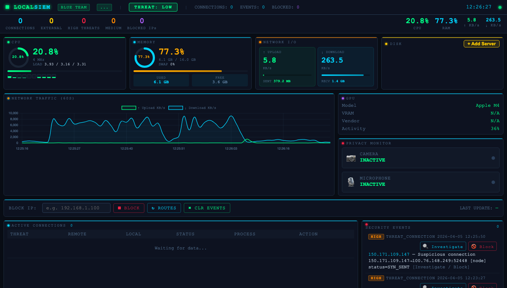

---

# 🛡️ LocalSIEM — Blue Team Security Monitor

A free, open-source, real-time security dashboard for macOS. Monitor your system, detect threats, and block suspicious IPs — all from your browser. Built for Apple Silicon (M1/M2/M3/M4).

   


---

## 📸 What It Does

Feature / Description

| 🖥️ System Monitor | Live CPU, RAM, GPU and Disk gauges |
| 🌐 Network Traffic | Real-time 60-second send/receive chart |
| 🔌 Active Connections | Every TCP connection with process name and threat level |
| 🚨 Threat Detection | Detects port scans, high connection rates, suspicious ports |
| 🌍 IP Investigation | Click any IP → geo location, country, traceroute, whois |
| 🚫 IP Blocking | Block suspicious IPs directly via macOS firewall (pf) |
| 🌐 Active Websites | Live DNS-resolved domains your machine is connecting to |
| 📷 Privacy Monitor | Alerts when camera or microphone is activated |
| 🖴 Disk Monitor | All drives with usage bars + add custom server/NAS paths |
| 🔒 Security Events | Live feed of all detected threats with one-click investigation |

---

## ⚙️ Requirements

- macOS (Apple Silicon M1/M2/M3/M4)
- Python 3.10 or higher
- Terminal access

> ⚠️ This app is "macOS only". It uses macOS-specific tools (`ioreg`, `pfctl`, `lsof`) that do not exist on Windows or Linux.


## 🚀 Installation

### Option 1 — One-Line Installer (Recommended)

Open Terminal and paste:

```bash
curl -sSL https://raw.githubusercontent.com/sagar12-web/SIEM-Monitor/main/install.sh | bash
```

This will automatically:
- Download all app files to `~/LocalSIEM/`
- Install Python dependencies
- Create a **Desktop shortcut** (double-click to launch)
- Create `LocalSIEM.app` in `~/Applications`
- Ask if you want to launch immediately

---

### Option 2 — Manual Install

Step 1 — Clone the repository
```bash
git clone https://github.com/sagar12-web/SIEM-Monitor.git
cd SIEM-Monitor
```

Step 2 — Install dependencies
```bash
pip3 install -r requirements.txt
```

Step 3 — Start the server
```bash
python3 siem_server.py
```

Step 4 — Open the dashboard

Open your browser and go to:
```
http://localhost:5555
```

---

## 🖥️ How To Use

### Dashboard Overview

Once the server is running, open `http://localhost:5555` in any browser.


---




---

### 🔍 Investigating a Suspicious IP

1. A threat appears in the "Security Events" feed
2. Click the event **or** click the 🔍 button in the connections table
3. An investigation panel opens showing:
   - 🌍 Country, city, ISP and flag
   - 🔄 Full traceroute with per-hop geo
   - 📋 WHOIS information
   - 🔌 All active connections from that IP
4. Click 🚫 BLOCK IP** to block it instantly via the macOS firewall

---

### 🚫 Blocking an IP

Two ways to block:
- From the "connections table" → click `BLOCK` button on any row
- From the "investigation modal" → click `🚫 BLOCK IP`

Blocked IPs are listed in the "Blocked IPs** panel. The block uses macOS `pf` firewall and takes effect immediately.

> Note: Blocks require `sudo` access the first time. You may be prompted for your Mac password.

---

### 📷 Privacy Monitor

The Privacy Monitor card shows real-time camera and microphone status.

- 🟢 INACTIVE — device is off
- 🔴 ACTIVE — device is in use (card border blinks red, banner alert appears)

Detection uses Apple Silicon's built-in `ioreg` hardware reporting — no special permissions needed for camera. Microphone detection is best-effort via active audio processes.

---

### 🖴 Adding a Custom Disk / Server

1. In the "Disk card, click + Add Server
2. Enter the mount path (e.g. `/Volumes/MyNAS`, `/Volumes/ExternalDrive`)
3. Enter a display label (e.g. `Backup Server`)
4. Click Add Disk

Custom disks show with a cyan border and a `custom` badge. Click **✕** to remove them.

---

### 🚨 Threat Levels

| Level | Trigger |
|---|---|
| 🔴 HIGH | Port scan (10+ unique ports in 60s) or very high connection rate |
| 🟡 MEDIUM | Suspicious port (e.g. 4444, 1337, 31337) or SYN flood pattern |
| 🟢 LOW | Unusual connection from unknown external IP |

---

## 🛑 Stopping the Server

In the Terminal where the server is running, press:
```
Ctrl + C
```

---

## 📁 Project Structure

```
SIEM-Monitor/
├── siem_server.py     # Python backend — Flask + SocketIO + all monitoring logic
├── dashboard.html     # Frontend — HTML/CSS/JavaScript dashboard
├── requirements.txt   # Python dependencies
└── install.sh         # One-line macOS installer script
```

---

## 🔧 Tech Stack

| Layer | Technology |
|---|---|
| Backend | Python 3, Flask, Flask-SocketIO |
| System Metrics | psutil, lsof, ioreg, system_profiler |
| Threat Detection | Custom rule engine (port scan, rate, suspicious ports) |
| Firewall | macOS pf (pfctl) |
| Frontend | HTML5, CSS3, JavaScript, Chart.js, Socket.IO |
| Geo / WHOIS | ip-api.com, traceroute, socket reverse DNS |

---

## 🤝 Contributing

Pull requests are welcome. For major changes, please open an issue first.

1. Fork the repo
2. Create your branch: `git checkout -b feature/my-feature`
3. Commit your changes: `git commit -m 'Add my feature'`
4. Push: `git push origin feature/my-feature`
5. Open a Pull Request

---

## ⚠️ Disclaimer

This tool is for **personal, local use only** on your own machine. Do not use it to monitor networks or systems you do not own. IP blocking modifies your system firewall — use with care.

---

## 📄 License

MIT License — free to use, modify and distribute.

---

*Built for macOS Apple Silicon — Local Blue Team Security Monitoring*
